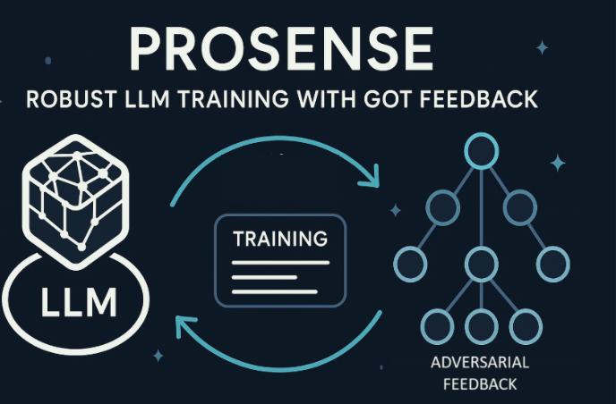
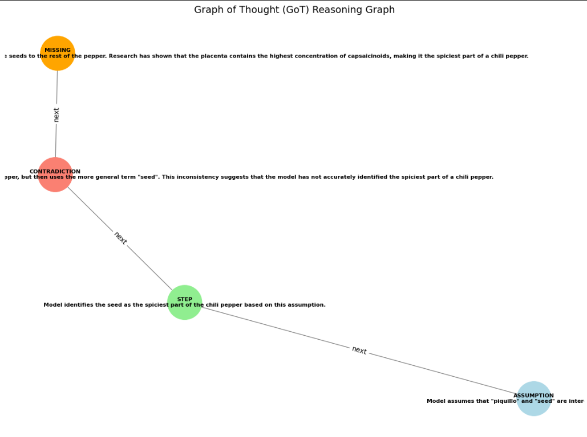

# Prosense: Defending Text Generation with Adversarial Feedback

<p align="center">
  
</p>

## Overview

**Prosense** is a robust multi-stage training framework designed to improve the truthfulness and adversarial resilience of large language models (LLMs). By leveraging structured feedback in the form of Graph-of-Thought (GoT) reasoning graphs, Prosense identifies and refines logical failures in model generations across multiple curriculum-based fine-tuning cycles.

It utilizes a 4-bit quantized Mistral-7B model, adversarially generated training data, and structured reasoning evaluation using TruthfulQA, LLaMA, and custom parsing logic.

> _All training was conducted on a **single A100 or H100 GPU** using RunPod, making the pipeline cost-effective and reproducible on minimal hardware._

---

## Key Features

- **Multi-Stage Fine-Tuning**: Progressive model refinement through clean, hybrid, and GoT-tagged data.
- **Adversarial Feedback Loop**: Custom parsing and judgment of failed generations to feed adversarial reasoning graphs back into training.
- **TruthfulQA Integration**: Performance benchmarking using widely recognized adversarial QA tasks.
- **Graph-of-Thought Parsing**: Converts flawed model outputs into structured logical error paths.
- **GPU-Efficient Setup**: Training optimized for single-GPU usage with quantized model support.

---

## Project Structure

```
Prosense-Adversarial-Robustness/
├── Phase1_Clean_FineTuning/
│   └── phase1.ipynb
├── Phase2_Adversarial_Hybrid/
│   ├── HybridDataCreation.ipynb
│   ├── MergingWithHybridDataset.ipynb
│   └── Phase2_Final.ipynb
├── Phase3_Evaluation_Parsing/
│   ├── Phase3_1_Collect_TruthfulQA_Responses.ipynb
│   ├── Phase3_2_Judge_and_Filter_Failures.ipynb
│   ├── Phase3_3_Parse_GOT_Graph_By_LLaMA.ipynb
│   └── Phase3_Final.ipynb
└── Phase3_Level2_Refinement/
    ├── Phase4_1_Collect_Level1_Responses.ipynb
    ├── Phase4_2_Judge_Parse_Level1_By_LLaMA.ipynb
    ├── Phase4_3_Level2_Finetune.ipynb
    ├── Phase4_4_Collect_Level2_Responses.ipynb
    ├── Phase4_5_Judge_Level2_Responses.ipynb
    └── Phase4_6_Reasoning_Graph_Visualization.ipynb
```

---

## Installation

1. Clone the repository:
   ```bash
   git clone https://github.com/AnuBaluguri/Prosense_Defending_Text_Generation_with_Adversarial_Feedback.git
   cd Prosense_Defending_Text_Generation_with_Adversarial_Feedback
   ```

2. Install dependencies:
   ```bash
   pip install -r requirements.txt
   ```

> Python 3.10+ and a 24GB+ GPU (A100/H100 recommended) for full training runs.

---

## Usage

Execute each notebook in the listed order to follow the full training and feedback pipeline:

### Phase 1: Clean Fine-Tuning
- `phase1.ipynb`

### Phase 2: Adversarial Dataset & Hybrid Training
- `HybridDataCreation.ipynb`
- `MergingWithHybridDataset.ipynb`
- `Phase2_Final.ipynb`

### Phase 3: Evaluation + GoT Feedback
- `Phase3_1_Collect_TruthfulQA_Responses.ipynb`
- `Phase3_2_Judge_and_Filter_Failures.ipynb`
- `Phase3_3_Parse_GOT_Graph_By_LLaMA.ipynb`
- `Phase3_Final.ipynb`

### Phase 4: Second-Level Feedback & Finalization
- `Phase4_1_Collect_Level1_Responses.ipynb`
- `Phase4_2_Judge_Parse_Level1_By_LLaMA.ipynb`
- `Phase4_3_Level2_Finetune.ipynb`
- `Phase4_4_Collect_Level2_Responses.ipynb`
- `Phase4_5_Judge_Level2_Responses.ipynb`
- `Phase4_6_Reasoning_Graph_Visualization.ipynb`

---

## Advanced Features

- **Graph-of-Thought Analysis**: Each reasoning failure is parsed into a tree-like structure for targeted re-training.
- **Curriculum Feedback Loop**: Two rounds of adversarial feedback fine-tune the model using progressively structured error patterns.
- **Inference-Ready Checkpoints**: Outputs include final weights and tokenized datasets (excluded from repo).

---

## Results

<p align="center">
  
</p>

Above: A Graph-of-Thought (GoT) visualization highlighting missing logical steps, contradictions, and flawed assumptions in a model-generated answer.

**Performance Summary:**
- TruthfulQA Pass Rate: **35% → 55%** after Phase 3
- Robustness Improvement: **+30%** on adversarial samples

---

## Contributing

We welcome contributions!  
To propose a fix or feature:
1. Fork the repository
2. Create a new branch
3. Submit a pull request with a clear explanation

---

## License

This project is licensed under the [MIT License](LICENSE).

---

## Acknowledgments

- [UnsLoTh](https://github.com/unslothai/unsloth) – Quantized LLM fine-tuning
- [Meta](https://ai.meta.com/) – LLaMA 3 models
- [Hugging Face](https://huggingface.co) – Open-Instruct & TruthfulQA datasets
- [RunPod](https://www.runpod.io) – GPU compute support

